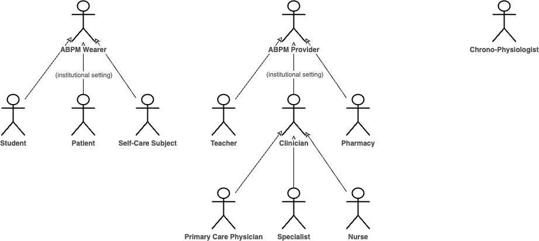

!!! bug
    The diagrams in this article are out-of-date but included as placeholders to organize the article.

## Actors

### Actor profile table

| Actor | Profile: Background and Skills |
| ----- | ------------------------------ |
| patient | May be sick or may want to know health status.  May vary between “Does not want to be bothered” and wanting biofeedback to modify behavior |
| specialist | a physician  Called for help by primary care physician |
| clinician | Deals directly with patients  May access medical records  May be primary care physician, secondary care physician (specialist), physician’s assistant, registered nurse, nursing assistant, certified medical assistant |
| physician | a clinician  makes clinical decisions  diagnoses patient |
| nurse | a clinician  Deals directly with device  Manages interaction between device and patient  Responsible for data transfer  Creates report for physician  Creates report for patient |

## Context

## Use cases

## Required attributes

Inexpensive
: [Free and open source](https://en.wikipedia.org/wiki/Free_and_open-source_software){: target="_blank" }

Highly decomposed
: Each component quickly engineered by very small team (usually one person)

Extensible &mdash; highly recomposable
: Multiple actors, vaguely organized
: Evolving user classes, usage scenarios, environments
: Highly re-usable components

Scalable
: Ready to cope with volume increases due to:
  - Wearers
  - Acquired data
  - Analysis requests

Secure
: &nbsp;

Maintains privacy of data subject
: &nbsp;

